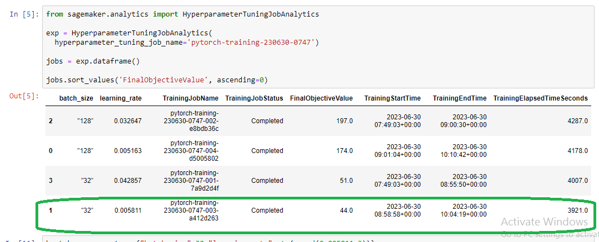
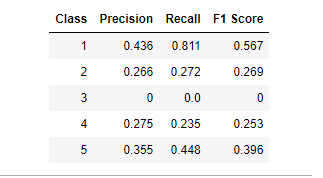
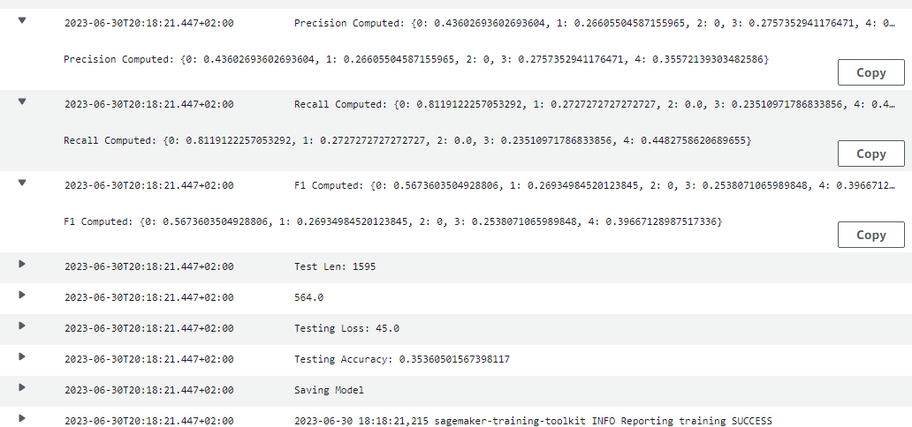

# AWS Machine Learning Engineer Nanodegree Capstone

This project is a part of the assessment in the Udacity's AWS Machine Learning Engineer Nanodegree Program.

# Inventory Monitoring at Distribution Centres (Amazon Bin Image Dataset)

### Overview

Artificial intelligence in inventory management is yielding hefty and impressive improvements for the companies that are utilizing it like Amazon and others. We are on the verge of a major upheaval in the way inventory is managed. This revolution is a result of the availability of huge amounts of real-time data that are now routinely generated on the internet and through the interconnected world of enterprise software systems and smart products. In order to make effective use of this new data and to stay competitive, managers will need to redesign their supply-chain processes. Amazon, for example, implemented artificial intelligence throughout their inventory operations, at an unprecedented scale. In almost every aspect of their operations, AI methodologies such as time series prediction and reinforcement learning systems are being deployed. User demand, supplier backorders, warehouse optimization, and stock levels are all being guided by either machine learning or more complex artificial intelligence systems.

## Dataset

### Overview
To complete this project we will be using the Amazon Bin Image Dataset. The dataset contains 500,000 images of bins containing one or more objects. For each image, there is a metadata file containing information about the image like the number of objects, its dimension, and the type of object. For this task, we will try to classify the number of objects in each bin.
An example of an image and the corresponding metadata file is shown as below:

{
    "BIN_FCSKU_DATA": {
        "B000A8C5QE": {
            "asin": "B000A8C5QE",
            "height": {
                "unit": "IN",
                "value": 4.200000000000001
            },
            "length": {
                "unit": "IN",
                "value": 4.7
            },
            "name": "MSR PocketRocket Stove",
            "quantity": 1,
            "weight": {
                "unit": "pounds",
                "value": 0.45
            },
            "width": {
                "unit": "IN",
                "value": 4.4
            }
        },
        "B0064LIWVS": {
            "asin": "B0064LIWVS",
            "height": {
                "unit": "IN",
                "value": 1.2
            },
            "length": {
                "unit": "IN",
                "value": 5.799999999999999
            },
            "name": "Applied Nutrition Liquid Collagen Skin Revitalization, 10 Count 3.35 Fl Ounce",
            "quantity": 1,
            "weight": {
                "unit": "pounds",
                "value": 0.3499999999999999
            },
            "width": {
                "unit": "IN",
                "value": 4.7
            }
        }
    },
    "EXPECTED_QUANTITY": 2,
    "image_fname": "523.jpg"
}

The “EXPECTED_QUANTITY” field tells us the total number of objects in the image.
However, since this dataset is too large to use as a learning project, and due to
cost limitations on the Udacity AWS Portal, we will be using a subset of the
data provided to us by Udacity itself.

### Access

Check out 

## Model Training
We chose a convolutional neural network with a pre-trained model (ResNet50 Model) check out , and we did hyperparameter searching to leverage model performance. 

The best hyperparameters were:
Batch size 32, Learning rate 0.0058

For more details check out  and 

### Model Metrics: 

### AWS Cloudwatch logs:

## Machine Learning Pipeline

* Data Preparation and Analysis
* Hyperparameter Search
* Training model with best hyperparameters 
* Model Evaluation and Deployment

## Standout Suggestions

* Hyper-parameter Tuning
* Model Deployment and Inference
* Balancing classes by fetching more data.
